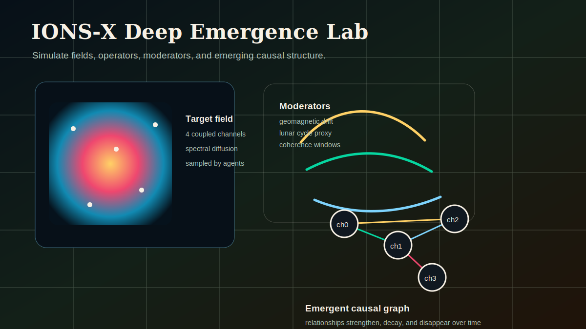

# IONS-X Deep Emergence Lab



IONS-X Deep Emergence Lab is a small Python simulation for watching causal hints emerge inside coupled dynamical fields.

It creates a 4-channel target field, sends autonomous operators across it, modulates the environment over time, and draws the relationships those operators discover. The point is not to prove nonlocal effects. The point is to give researchers and builders a repeatable sandbox for exploring hypotheses about field dynamics, collective sensing, and signal discovery.

## What You See

Running the simulation produces an HTML animation with three live views:

- **Target field:** a heatmap of one evolving field channel.
- **Emergent graph:** discovered relationships between channels as confidence rises and decays.
- **Run stats:** cumulative discoveries, active environmental coherence factor, REG variance deviation, and sensor anomaly multi-scale ratios.

## Quickstart

From a fresh clone:

```bash
git clone https://github.com/topherchris420/ions-x-deep-emergence-lab.git
cd ions-x-deep-emergence-lab
python -m venv .venv
python -m pip install -r requirements.txt
python ions_x_deep_emergence.py --quick
```

The default output is:

```text
outputs/latest.html
```

Open that file in your browser after the run completes.

On Windows PowerShell, use `py` if `python` is not on your path:

```powershell
py -m venv .venv
.\.venv\Scripts\Activate.ps1
py -m pip install -r requirements.txt
py ions_x_deep_emergence.py --quick
start outputs\latest.html
```

## Command-Line Options

```bash
python ions_x_deep_emergence.py --quick --output outputs/demo.html
python ions_x_deep_emergence.py --frames 120 --agents 100 --field-res 64
python ions_x_deep_emergence.py --preset empirical --input-data continuous_telemetry.csv
python ions_x_deep_emergence.py --preset baseline --input-data continuous_telemetry.csv
python ions_x_deep_emergence.py --quick --show
```

| Option | What it does |
| --- | --- |
| `--quick` | Uses a smaller run for first-time users and demos. |
| `--frames N` | Sets the number of animation frames. |
| `--agents N` | Sets the number of autonomous operators. |
| `--field-res N` | Sets the 2D field resolution. |
| `--output PATH` | Saves the HTML animation to a specific path. |
| `--show` | Also displays inline when running in an IPython notebook. |

A successful run prints a short summary:

```text
Simulation complete. Preset: synthetic. Frames: 60. Agents: 50. Field: 64x64. Backend: CPU. Output: outputs/latest.html
```


## Longitudinal Empirical Runs

The empirical preset maps a CSV into the ATOM target field. Recognized column names include:

| ATOM channel | Preferred column | Other accepted names |
| --- | --- | --- |
| Channel 0 EM/RF telemetry | `em_rf` | `electromagnetic_rf`, `magnetometer`, `rf_noise`, `rf_spectrum_noise`, `channel_0` |
| Channel 1 optical/IR anomaly | `optical_ir` | `optical_ir_anomaly`, `pixel_variance`, `sky_pixel_variance`, `ir_anomaly`, `channel_1` |
| Channel 2 consciousness proxy | `reg_variance` | `consciousness_proxy`, `reg_entropy`, `egg_variance`, `raw_entropy`, `channel_2` |
| Channel 3 control baseline | generated locally | pseudo-random control values are generated by the run |

Optional moderator columns are `kp_index`, `lunar_phase`, `sidereal_time`, and `xray_flux`. Missing timestamps and null sensor blocks are forward-filled, then backfilled only for leading gaps, so long-running telemetry files can continue through brief outages.

Empirical and baseline runs export:

```text
outputs/longitudinal_run_[timestamp].csv.gz
outputs/metadata_[timestamp].json
```

Each discovery row includes timestamp, channel pair, Pearson correlation, confidence score, active moderator values, and operator density.

## The ATOM Model

This implementation is organized around the ATOM framing used by the IONS-X research strategy.

### Analyses

Multi-scale relationship detection over recent operator observations.

### Targets

A 2D, 4-channel field. Synthetic mode still evolves coupled fields through spectral diffusion; empirical and baseline presets map time-series telemetry directly into spatial-temporal target grids.

### Operators

Autonomous agents that sample field values, keep short memory, and report correlations above a confidence threshold.

### Moderators

Environmental modulation terms, including periodic variation and short coherence windows.

## Glossary

| Term | Meaning in this repo |
| --- | --- |
| Target | The simulated field being sampled. |
| Operator | An autonomous sampling agent. |
| Moderator | A changing environmental factor that affects field evolution. |
| Discovery | A channel relationship whose correlation exceeds the configured threshold. |
| Coherence window | A short period where modulation is boosted. |
| Emergent graph | The directed graph of currently active discoveries. |

## Research Applications

This lab is useful for prototyping ideas around:

- Nonlocal correlation discovery and collective signal detection.
- Direct mind-machine interaction simulation as a computational hypothesis space.
- Associative remote viewing style forecasting experiments against noisy, temporally displaced data.

Treat the output as a simulation artifact, not a scientific claim by itself. The value is in repeatable experiments, clearer assumptions, and testable changes.

## Run Tests

Install the dev dependencies, then run pytest:

```bash
python -m pip install -r requirements-dev.txt
python -m pytest
```

## Repository Layout

```text
ions_x_deep_emergence.py      # simulation, CLI, and HTML output
requirements.txt              # runtime dependencies
requirements-dev.txt          # runtime deps plus pytest
tests/                        # deterministic unit tests
docs/assets/preview.svg       # README visual preview
```

## Next Best Improvements

- Add a generated GIF from a known quick run.
- Add named experiment presets, for example `--preset arv` or `--preset coherence`.
- Add a small notebook that explains the model step by step.
