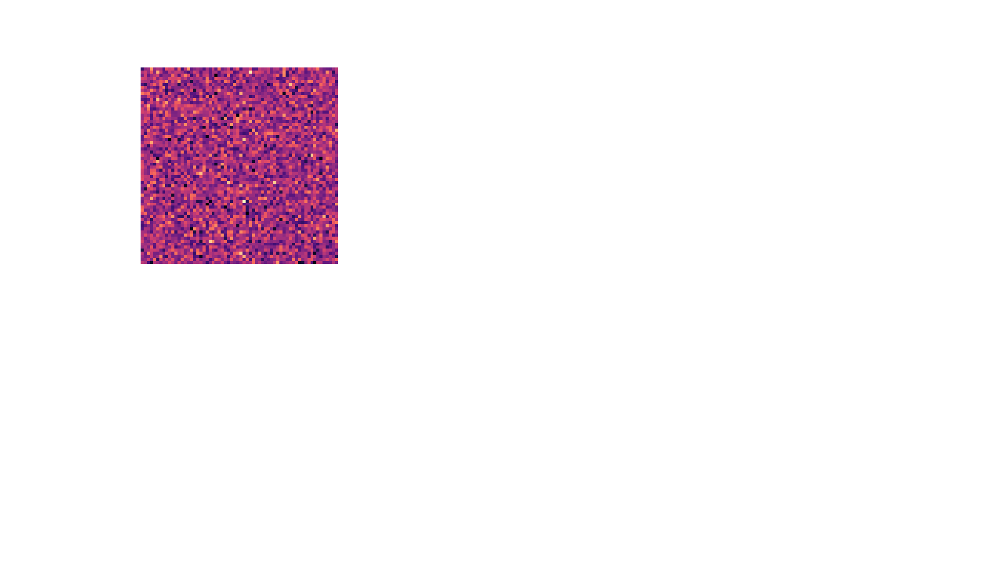

# IONS-X Deep Emergence Lab

> A GPU-optional, multi-agent sandbox for watching causal hints emerge inside coupled dynamical fields.



*A real run: autonomous operators sample an evolving 4-channel field (left) while the emergent graph of discovered channel relationships forms and decays (right). Generated with `python ions_x_deep_emergence.py --frames 80 --agents 140 --field-res 64 --output docs/assets/demo.gif`.*

IONS-X Deep Emergence Lab is a small Python simulation for watching causal hints emerge inside coupled dynamical fields.

It creates a 4-channel target field, sends autonomous operators across it, modulates the environment over time, and draws the relationships those operators discover. The point is not to prove nonlocal effects. The point is to give researchers and builders a repeatable sandbox for exploring hypotheses about field dynamics, collective sensing, and signal discovery.

## What You See

Running the simulation produces an HTML animation with three live views:

- **Target field:** a heatmap of one evolving field channel.
- **Emergent graph:** discovered relationships between channels as confidence rises and decays.
- **Run stats:** cumulative discoveries, active environmental coherence factor, REG variance deviation, and sensor anomaly multi-scale ratios.

## Quickstart

From a fresh clone:

```bash
git clone https://github.com/topherchris420/ions-x-deep-emergence-lab.git
cd ions-x-deep-emergence-lab
python -m venv .venv
python -m pip install -r requirements.txt
python ions_x_deep_emergence.py --quick
```

The default output is:

```text
outputs/latest.html
```

Open that file in your browser after the run completes.

On Windows PowerShell, use `py` if `python` is not on your path:

```powershell
py -m venv .venv
.\.venv\Scripts\Activate.ps1
py -m pip install -r requirements.txt
py ions_x_deep_emergence.py --quick
start outputs\latest.html
```

## Command-Line Options

```bash
python ions_x_deep_emergence.py --quick --output outputs/demo.html
python ions_x_deep_emergence.py --experiment arv                 # named parameter bundle
python ions_x_deep_emergence.py --frames 120 --agents 100 --field-res 64
python ions_x_deep_emergence.py --quick --output outputs/demo.gif # shareable GIF
python ions_x_deep_emergence.py --preset empirical --input-data continuous_telemetry.csv
python ions_x_deep_emergence.py --preset baseline --input-data continuous_telemetry.csv
python ions_x_deep_emergence.py --quick --show
```

| Option | What it does |
| --- | --- |
| `--quick` | Uses a smaller run for first-time users and demos. |
| `--experiment NAME` | Starts from a named parameter bundle (see below). Explicit flags still override it. |
| `--frames N` | Sets the number of animation frames. |
| `--agents N` | Sets the number of autonomous operators. |
| `--field-res N` | Sets the 2D field resolution. |
| `--preset MODE` | Run mode: `synthetic`, `baseline`, or `empirical`. |
| `--input-data PATH` | CSV telemetry for `empirical`/`baseline` runs. |
| `--output PATH` | Output path. A `.html` suffix writes an interactive animation; a `.gif` suffix writes a shareable clip. |
| `--fps N` | Frame rate when writing a `.gif`. |
| `--no-metrics-sidecar` | Skip writing the `<output>.metrics.json` summary. |
| `--show` | Also displays inline when running in an IPython notebook. |

A successful run prints a short summary:

```text
Simulation complete. Preset: synthetic. Experiment: balanced. Frames: 60. Agents: 50. Field: 64x64. Backend: CPU. Output: outputs/latest.html. Summary: outputs/latest.metrics.json
```

## Experiment Presets

Named presets bundle sensible parameters so you do not have to tune raw numbers first. Any explicit flag overrides the preset.

| `--experiment` | Intent | Key settings |
| --- | --- | --- |
| `balanced` | The shipped defaults. | — |
| `quick` | Fast first run or demo. | small field, 50 agents, 60 frames |
| `arv` | Associative-remote-viewing style: patient operators reading long temporal displacement. | wide lag/memory, larger correlation window, lower threshold |
| `coherence` | Emphasize environmental coherence windows. | lower threshold, slower confidence decay, more agents |
| `dense-agents` | Study crowding and operator density. | 800 agents on a 96×96 field |

```bash
python ions_x_deep_emergence.py --experiment coherence
python ions_x_deep_emergence.py --experiment dense-agents --frames 120   # flag overrides preset frames
```

## Metrics Sidecar

Every run writes a small JSON summary next to the animation (disable with `--no-metrics-sidecar`):

```text
outputs/demo.html
outputs/demo.metrics.json
```

The sidecar records preset, experiment, frame/agent counts, backend, total discoveries, discoveries per operator type, the coherence frames, and the per-frame discovery-rate history — enough to compare runs without reopening the animation.

## Guided Notebook

`notebooks/quickstart.ipynb` walks through the field, operators, moderators, and emergent graph in small cells using quick settings. It runs top-to-bottom locally or in Colab (clone the repo first).


## Longitudinal Empirical Runs

The empirical preset maps a CSV into the ATOM target field. Recognized column names include:

| ATOM channel | Preferred column | Other accepted names |
| --- | --- | --- |
| Channel 0 EM/RF telemetry | `em_rf` | `electromagnetic_rf`, `magnetometer`, `rf_noise`, `rf_spectrum_noise`, `channel_0` |
| Channel 1 optical/IR anomaly | `optical_ir` | `optical_ir_anomaly`, `pixel_variance`, `sky_pixel_variance`, `ir_anomaly`, `channel_1` |
| Channel 2 consciousness proxy | `reg_variance` | `consciousness_proxy`, `reg_entropy`, `egg_variance`, `raw_entropy`, `channel_2` |
| Channel 3 control baseline | generated locally | pseudo-random control values are generated by the run |

Optional moderator columns are `kp_index`, `lunar_phase`, `sidereal_time`, and `xray_flux`. Missing timestamps and null sensor blocks are forward-filled, then backfilled only for leading gaps, so long-running telemetry files can continue through brief outages.

Empirical and baseline runs export:

```text
outputs/longitudinal_run_[timestamp].csv.gz
outputs/metadata_[timestamp].json
```

Each discovery row includes timestamp, channel pair, Pearson correlation, confidence score, active moderator values, and operator density.

## The ATOM Model

This implementation is organized around the ATOM framing used by the IONS-X research strategy.

### Analyses

Multi-scale relationship detection over recent operator observations.

### Targets

A 2D, 4-channel field. Synthetic mode still evolves coupled fields through spectral diffusion; empirical and baseline presets map time-series telemetry directly into spatial-temporal target grids.

### Operators

Autonomous agents that sample field values, keep short memory, and report correlations above a confidence threshold.

### Moderators

Environmental modulation terms, including periodic variation and short coherence windows.

## Glossary

| Term | Meaning in this repo |
| --- | --- |
| Target | The simulated field being sampled. |
| Operator | An autonomous sampling agent. |
| Moderator | A changing environmental factor that affects field evolution. |
| Discovery | A channel relationship whose correlation exceeds the configured threshold. |
| Coherence window | A short period where modulation is boosted. |
| Emergent graph | The directed graph of currently active discoveries. |

## Research Applications

This lab is useful for prototyping ideas around:

- Nonlocal correlation discovery and collective signal detection.
- Direct mind-machine interaction simulation as a computational hypothesis space.
- Associative remote viewing style forecasting experiments against noisy, temporally displaced data.

Treat the output as a simulation artifact, not a scientific claim by itself. The value is in repeatable experiments, clearer assumptions, and testable changes.

## Run Tests

Install the dev dependencies, then run pytest:

```bash
python -m pip install -r requirements-dev.txt
python -m pytest
```

## Repository Layout

```text
ions_x_deep_emergence.py      # simulation, CLI, and HTML/GIF output
pyproject.toml                # packaging, ruff, and pytest configuration
requirements.txt              # runtime dependencies
requirements-dev.txt          # runtime deps plus pytest and ruff
tests/                        # deterministic unit tests
notebooks/quickstart.ipynb    # guided walkthrough
docs/assets/demo.gif          # generated demo from a real run
docs/assets/preview.svg       # static README preview
.github/workflows/ci.yml      # lint + test + smoke render on 3.10-3.12
```

## Development

```bash
python -m pip install -r requirements-dev.txt
ruff check .
python -m pytest -q
```

See [CONTRIBUTING.md](CONTRIBUTING.md) for the full workflow and how to add an experiment preset.

## Next Best Improvements

- Stream metrics to a live dashboard during long empirical runs.
- Add a `--seed` flag to vary runs while staying reproducible.
- Publish the package to PyPI so `pip install ions-x-deep-emergence-lab` works.
