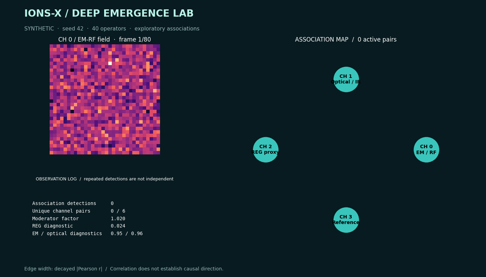

# IONS-X Deep Emergence Lab

> A GPU-optional, multi-agent sandbox for watching causal hints emerge inside coupled dynamical fields.

[](https://github.com/topherchris420/ions-x-deep-emergence-lab/actions/workflows/ci.yml)


[](https://github.com/astral-sh/ruff)



*A real run: autonomous operators sample an evolving 4-channel field (left) while the emergent graph of discovered channel relationships forms and decays (right). Generated with `ions-x --frames 80 --agents 140 --field-res 64 --output docs/assets/demo.gif`.*

---

**IONS-X Deep Emergence Lab** is a Python simulation environment for exploring how causal hints and nonlocal structure emerge inside coupled dynamical fields.

It creates a 4-channel target field, deploys autonomous sensing operators across the spatial grid, modulates environmental parameters over time, and reconstructs the emergent graph of channel relationships discovered by the collective. The goal is to provide researchers and builders with a **repeatable, deterministic sandbox** for testing computational hypotheses about field dynamics, collective sensing, and signal discovery.

---

## What You See

Running the simulation generates an interactive HTML animation (or shareable GIF) with three synchronized views:

- **Target Field:** Real-time spatial heatmap of evolving field channels (spectral diffusion in synthetic mode; spatialized telemetry in empirical mode).
- **Emergent Graph:** Directed network graph tracking discovered channel relationships as confidence weights strengthen and decay.
- **Live Run Stats:** Cumulative discoveries, active environmental coherence factor, REG variance deviation, and multi-scale sensor anomaly ratios.

---

## Quickstart

### 1. Install & Run via `ions-x` CLI

```bash
git clone https://github.com/topherchris420/ions-x-deep-emergence-lab.git
cd ions-x-deep-emergence-lab

# Create and activate virtual environment
python -m venv .venv
source .venv/bin/activate   # On Windows: .venv\Scripts\Activate.ps1

# Install in editable mode
python -m pip install -e .

# Run a quick simulation with live console streaming
ions-x --quick --seed 42 --live
```

Default output is saved to:
```text
outputs/latest.html
outputs/latest.metrics.json
```
Open `outputs/latest.html` in any web browser to view the interactive animation.

### 2. Windows PowerShell One-Liner

```powershell
py -m venv .venv; .\.venv\Scripts\Activate.ps1; py -m pip install -e .; ions-x --quick --seed 42 --live; start outputs\latest.html
```

---

## Python API Usage

You can import and run simulations directly inside your own Python scripts or Jupyter notebooks:

```python
import ions_x_deep_emergence as ions_x

# Run an experiment programmatically
result = ions_x.main([
    "--experiment", "arv",
    "--seed", "42",
    "--frames", "100",
    "--output", "outputs/my_experiment.html",
])

print(f"Output saved to: {result.output_path}")
print(f"Metrics sidecar: {result.summary_path}")
print(f"Calibration threshold: {result.calibration_threshold}")
```

---

## Command-Line Options

```bash
ions-x --quick --seed 42 --live --output outputs/demo.html
ions-x --experiment arv                               # Associative Remote Viewing preset
ions-x --experiment coherence --seed 100              # Environmental coherence focus
ions-x --frames 120 --agents 100 --field-res 64       # Custom parameter run
ions-x --quick --output outputs/demo.gif              # Shareable GIF animation
ions-x --preset empirical --input-data telemetry.csv  # Empirical CSV study
ions-x --preset baseline --input-data telemetry.csv   # Baseline control calibration
ions-x --quick --show                                 # Inline display in Jupyter notebooks
```

| Option | Description | Default |
| :--- | :--- | :--- |
| `--quick` | Smaller, faster configuration for demos and quick testing. | `False` |
| `--experiment NAME` | Start from a named parameter bundle (`balanced`, `quick`, `arv`, `coherence`, `dense-agents`). | `balanced` |
| `--seed N` | Set random seed for deterministic, 100% reproducible runs. | `42` |
| `--live` | Stream metrics and telemetry live in console / notebook during render. | `False` |
| `--frames N` | Number of animation frames to simulate and render. | `500` (`60` in quick) |
| `--agents N` | Number of autonomous sampling operators. | `300` (`50` in quick) |
| `--field-res N` | 2D field spatial grid resolution (`N x N`). | `128` (`64` in quick) |
| `--preset MODE` | Run mode: `synthetic` (default), `baseline` (null control), or `empirical` (CSV). | `synthetic` |
| `--input-data PATH` | CSV telemetry file path for empirical/baseline modes. | `None` |
| `--output PATH` | Output file path (`.html` for interactive animation, `.gif` for video). | `outputs/latest.html` |
| `--fps N` | Frame rate when exporting a `.gif` file. | `20` |
| `--no-metrics-sidecar` | Suppress writing the `<output>.metrics.json` sidecar summary. | `False` |
| `--show` | Render inline when executing inside an IPython / Jupyter environment. | `False` |

---

## Experiment Presets

Presets bundle sensible hyperparameter configurations for specific research scenarios. Explicit CLI flags always override preset defaults.

| `--experiment` | Research Intent | Key Settings |
| :--- | :--- | :--- |
| `balanced` | Standard default parameters. | 300 agents, 128x128 field, decay: 0.995, thresh: 0.32 |
| `quick` | Fast initial runs and demos. | 50 agents, 64x64 field, 60 frames, 4 samples/frame |
| `arv` | Associative Remote Viewing: long memory, wide lag windows, lower threshold for weak, delayed signals. | Memory: 500, Corr Window: 80, Lags: `[15,30,60,120]`, Thresh: 0.28 |
| `coherence` | Environmental coherence focus: slower confidence decay allows coherence-boosted structures to accumulate. | 400 agents, Thresh: 0.26, Decay: 0.997 |
| `dense-agents` | Crowding & operator density studies. | 800 agents on a 96x96 field |

```bash
ions-x --experiment coherence --seed 123 --live
ions-x --experiment dense-agents --frames 120    # Override preset frames
```

---

## Metrics Sidecar (`.metrics.json`)

Every run automatically produces a lightweight JSON sidecar next to the output file (disable with `--no-metrics-sidecar`):

```text
outputs/demo.html
outputs/demo.metrics.json
```

```json
{
  "backend": "CPU",
  "calibration_threshold": null,
  "coherence_frame_count": 3,
  "coherence_frames": [12, 13, 14],
  "discoveries_by_operator_type": {
    "forecaster": 4,
    "integrator": 3,
    "perceiver": 5
  },
  "discovery_rate_history": [0, 1, 0, 2, 0],
  "experiment": "balanced",
  "field_res": 64,
  "frames": 60,
  "generated_at": "2026-08-20T17:35:00.000000+00:00",
  "output_path": "outputs/demo.html",
  "preset": "synthetic",
  "seed": 42,
  "total_discoveries": 12
}
```

---

## Longitudinal Empirical Runs

In empirical mode, the lab ingests multi-sensor telemetry from CSV files, spatializes the signals across target field bases, applies real-world environmental moderator scaling, and exports comprehensive discovery logs.

### Accepted Column Schema

| ATOM Channel | Primary Column | Accepted Aliases |
| :--- | :--- | :--- |
| **Channel 0: EM/RF** | `em_rf` | `electromagnetic_rf`, `magnetometer`, `rf_noise`, `rf_spectrum_noise`, `channel_0` |
| **Channel 1: Optical/IR** | `optical_ir` | `optical_ir_anomaly`, `pixel_variance`, `sky_pixel_variance`, `ir_anomaly`, `channel_1` |
| **Channel 2: Consciousness Proxy** | `reg_variance` | `consciousness_proxy`, `reg_entropy`, `egg_variance`, `raw_entropy`, `channel_2` |
| **Channel 3: Control Baseline** | Local Gaussian Control | Synthetically generated uncorrelated baseline channel |

Optional environmental covariates include `kp_index`, `lunar_phase`, `sidereal_time`, and `xray_flux`.

### Exported Artifacts

Empirical runs export:
```text
outputs/longitudinal_run_[timestamp].csv.gz
outputs/metadata_[timestamp].json
```

Each discovery row records timestamp, channel pair, Pearson correlation, confidence score, active moderator values, and operator density.

---

## The ATOM Architecture

The simulation is built around the **ATOM** framing used by the IONS-X research program:

```
┌───────────────────────────────────────────────────────────────┐
│                      MODERATORS (M)                           │
│  Geomagnetic (Kp), Lunar Phase, Sidereal Time, Coherence      │
└──────────────┬────────────────────────────────┬───────────────┘
               │ Modulates Dynamics             │ Scales Threshold & Decay
               ▼                                ▼
┌───────────────────────────────┐      ┌────────────────────────┐
│         TARGETS (T)           │      │     OPERATORS (O)      │
│  Coupled 4-Channel 2D Field   │ ───► │  Autonomous Agents     │
│  (EM/RF, Opt/IR, REG, Ctrl)   │      │  (Sample & Remember)   │
└───────────────────────────────┘      └───────────┬────────────┘
                                                   │
                                                   ▼ Correlate & Detect
                                       ┌────────────────────────┐
                                       │     ANALYSES (A)       │
                                       │  Emergent Relationship │
                                       │  Graph & Confidence    │
                                       └────────────────────────┘
```

---

## Guided Notebook

`notebooks/quickstart.ipynb` walks through the field, operators, moderators, and emergent graph in interactive cells using quick settings. It runs top-to-bottom locally or in Google Colab.

---

## Development & Testing

```bash
# Install development dependencies
python -m pip install -e .[dev]

# Run linter
ruff check .

# Run complete test suite (28 deterministic tests)
python -m pytest -v

# Build distribution packages
python -m build
```

---

## License

This project is licensed under the [MIT License](LICENSE).
