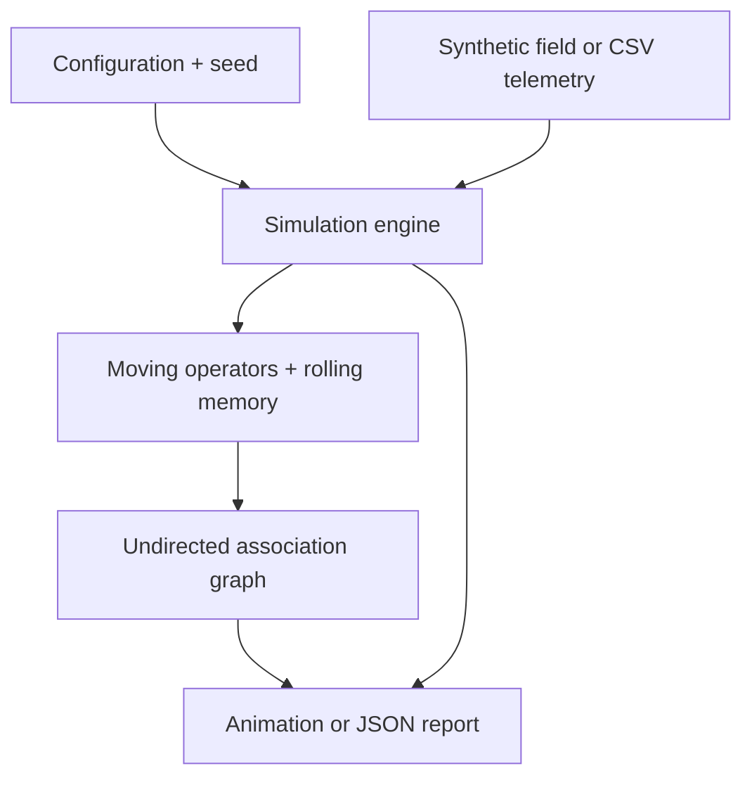

# IONS-X Deep Emergence Lab

> A reproducible sandbox for asking whether collective sensing can recover structure in a changing field—and what remains when that structure is removed.

[](https://github.com/topherchris420/ions-x-deep-emergence-lab/actions/workflows/ci.yml)


*Preview: actual 80-frame run with 40 agents on a 32×32 field, seed 42.*

IONS-X places moving sensing agents inside a four-channel field. Agents retain observations, measure rolling correlations, and contribute to a shared, decaying association graph. You can watch a run, analyze sensor CSVs, or run paired synthetic experiments without rendering a single frame.

**The useful question is not simply “did a pattern appear?” It is “does the detector respond differently when the injected coupling is absent?”** The paired control study makes that question executable.

This is exploratory simulation software from Vers3Dynamics. Its outputs are associations, not demonstrations of causality, consciousness, or nonlocal effects. “Confidence” in legacy exports means absolute Pearson correlation, not statistical confidence. See [experiment design and limitations](docs/experiment-design.md).

## Start with one experiment

```bash
git clone https://github.com/topherchris420/ions-x-deep-emergence-lab.git
cd ions-x-deep-emergence-lab
python -m venv .venv
source .venv/bin/activate     # Windows PowerShell: .\.venv\Scripts\Activate.ps1
python -m pip install -e .

ions-x --quick --seed 42 --live
```

Open `outputs/latest.html`. The adjacent `outputs/latest.metrics.json` records detections, unique channel pairs, the effective configuration, code identity, dependency versions, and seed.

The animation shows the channel-0 field, a stable **undirected** graph, and the observation log. Edge width follows the current decayed correlation weight. The renderer and headless mode use the same simulation engine; rendering does not add extra observations.

## Ask what survives the control

```bash
ions-x --quick --control-study 8 --frames 100 --agents 40 --field-res 32 \
  --seed 42 --output outputs/control-study.json
```

For each seed, the engine runs two arms:

| Coupled field | Uncoupled field |
| --- | --- |
| Channel 1 contributes to channel 0 continuously. | This contribution is disabled. |
| Channel 2 contributes to channel 3 during coherence windows. | This contribution is disabled. |
| Seeded initialization, diffusion, nonlinear dynamics, moderator events, and agent movements. | The same initialization, dynamics, events, and movements. |

The JSON report contains each paired run, per-pair detection rates, and the mean and range of paired differences. A detection rate is detections divided by eligible agent-windows for that pair. It is **not a probability of a true relationship**. Agents and overlapping windows are dependent; the report deliberately does not turn their count into a sample size for a significance test.

A [checked eight-seed example](docs/experiment-design.md#checked-example-eight-paired-seeds) includes the complete report and observed detection rates.

This is a coupling ablation benchmark for the synthetic model. It is distinct from `--preset baseline`, which analyzes independent Gaussian channel series with a heuristic threshold. Neither is a validated null model for arbitrary empirical data.

## Run without rendering

```bash
ions-x --quick --headless --frames 200 --seed 42 --output outputs/run.json
```

Headless mode writes one JSON report and skips Matplotlib rendering. It is useful for batch work and reproducibility checks. The report distinguishes repeated detections from unique associations and records the actual number of processed frames.

```python
import ions_x_deep_emergence as lab

result = lab.main([
    "--quick", "--headless", "--frames", "100",
    "--seed", "42", "--output", "outputs/experiment.json",
])
print(result.summary_path)
```

CLI and `main()` calls reset configuration before applying options, so a previous experiment cannot silently change the next one. The lower-level `SimulationEngine` API uses the module configuration and RNG: configure once, then run sequentially. Concurrent engines are not supported.

## Analyze sensor telemetry

```bash
ions-x --preset empirical --input-data telemetry.csv --headless \
  --output outputs/telemetry.json
```

| Channel | Canonical input | Selected aliases |
| --- | --- | --- |
| 0: EM / RF | `em_rf` | `magnetometer`, `rf_noise`, `rf_spectrum_noise`, `channel_0` |
| 1: Optical / IR | `optical_ir` | `pixel_variance`, `sky_pixel_variance`, `ir_anomaly`, `channel_1` |
| 2: REG proxy | `consciousness_proxy` | `reg_variance`, `reg_entropy`, `egg_variance`, `channel_2` |
| 3: Reference | Generated locally | Independent Gaussian series in empirical mode |

All three measured channels must contain numeric data. Missing or wholly unusable channels and infinite sensor/covariate values are rejected. Partial gaps retain the legacy offline forward-fill/backward-fill behavior, with imputed sensor-cell counts in the report. Optional covariates are `kp_index`, `lunar_phase`, `sidereal_time`, and `xray_flux`; absent covariates default to zero and are listed in the report.

An optional timestamp column accepts `timestamp`, `time`, `datetime`, `date_time`, or `utc_timestamp`. Missing/invalid timestamps are filled, or replaced with a synthetic minute index when none are valid. Input ordering is preserved. Rows are steps; elapsed timestamp gaps do not change the dynamics.

Empirical processing spatializes standardized series onto synthetic bases. It is an **offline exploration**, with full-series normalization and backward filling that can use future rows. It is not a causal online estimator. The environmental moderator equations are modeling assumptions, not validated physical relationships.

Runs also export `longitudinal_run_<unique-id>.csv.gz` and `metadata_<unique-id>.json` beside the requested output. Requests longer than the input are clamped to available rows and report the actual frame count. The passport includes the input file's SHA-256 and preprocessing information.

## Choose a configuration

```bash
ions-x --experiment coherence --seed 123 --output outputs/coherence.html
ions-x --quick --output outputs/demo.gif
ions-x --preset baseline --headless --frames 100 --output outputs/baseline.json
```

| Flag | Purpose |
| --- | --- |
| `--quick` | 50 agents, 64×64 field, 60 frames; explicit numeric flags override these values. |
| `--experiment NAME` | `balanced`, `quick`, `arv`, `coherence`, or `dense-agents`. |
| `--frames N`, `--agents N`, `--field-res N` | Positive integer runtime settings. |
| `--seed N` | NumPy RandomState seed, 0 through 4294967295. |
| `--headless` | JSON report without animation. |
| `--control-study N` | N paired seeds beginning at `--seed`; synthetic only, JSON output. |
| `--preset MODE` | `synthetic`, `empirical`, or `baseline`. |
| `--input-data PATH` | CSV telemetry; supplying a CSV without a preset is labeled empirical. |
| `--output PATH` | `.html` / `.gif` for animation, `.json` for headless or paired study. |
| `--fps N` | GIF playback frame rate; default 20. |
| `--live` | Stream progress for individual runs. |
| `--show` | Display the saved animation in an IPython notebook. |
| `--no-metrics-sidecar` | Omit the extra animation summary; headless/study JSON remains the primary output. |

| Experiment | Active differences from balanced |
| --- | --- |
| `balanced` | 300 agents, 128×128 field, 500 frames; 50-observation correlation window, threshold 0.32. |
| `quick` | 50 agents, 64×64 field, 60 frames. |
| `arv` | Memory 500, window 80, threshold 0.28, 400 frames. Historical preset name; no remote-viewing validation. |
| `coherence` | 400 agents, threshold 0.26, decay 0.997, 300 frames. |
| `dense-agents` | 800 agents, 96×96 field, 200 frames. |

`perceiver`, `forecaster`, and `integrator` currently label the **same rolling Pearson detector**. `LAG_FRAMES`, `SAMPLE_PER_FRAME`, and the three legacy moderator toggles do not alter the current engine; the passport lists these inactive settings. No lagged forecasting or distinct operator algorithm is claimed.

## Architecture


```mermaid
flowchart TD
    C["Configuration + seed"] --> E["Simulation engine"]
    T["Synthetic field or CSV telemetry"] --> E
    E --> O["Moving operators + rolling memory"]
    O --> G["Undirected association graph"]
    G --> R["Animation or JSON report"]
    E --> R
```

The ATOM framing organizes **analyses, targets, operators, and moderators**. The engine owns sequential state advancement; an explicit animation initializer prevents extra frame-zero steps, and duplicate requests for the current frame return its existing snapshot. Metrics, CSV records, and visualization therefore share one frame clock.

## Reproduce and contribute

```bash
python -m pip install -e '.[dev]'
python -m ruff check .
python -m pytest -q
python -m build
```

Tests compare real HTML and GIF execution against headless metrics, check exact frame counts and paired random schedules, and cover configuration isolation, empirical input rejection, provenance, and graph decay. CI runs Python 3.10–3.12 and uploads rendered, headless, and paired-study smoke artifacts.

Reproducibility means matching scientific metrics for the same code, input, effective configuration, backend, and dependency environment. Timestamps and output paths vary; CPU/GPU and dependency versions can introduce numerical differences. The passport records these distinctions rather than promising byte-identical output everywhere.

The [guided notebook](notebooks/quickstart.ipynb) introduces the existing API. See [CONTRIBUTING.md](CONTRIBUTING.md) and [experiment design](docs/experiment-design.md) before extending the detector.

MIT licensed. Built for open exploration.
